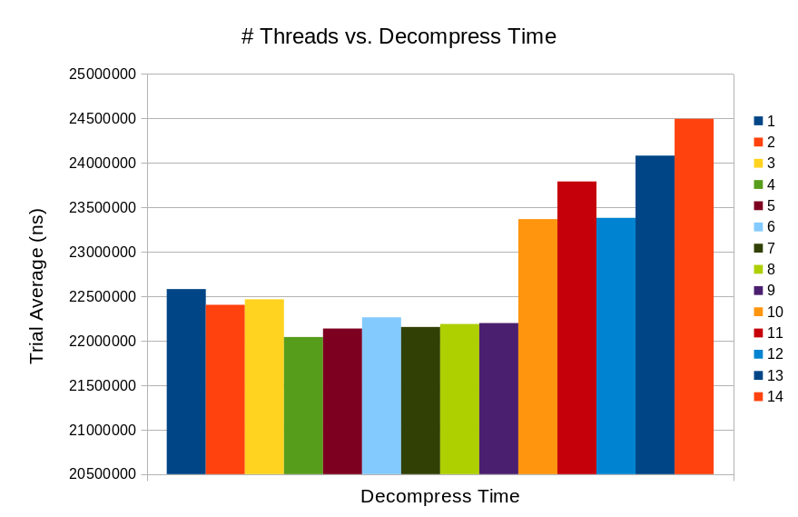

# ACS Compression
This project is an attempt at speeding up compression and decompression using multithreading.  The underlying compression algorithm is Facebook's ZSTD.  The codebase is written in C++ and allows for compression and decompression with any number of threads.

## OS Information
This project aims to build flexibly across linux systems -- specifically those that are POSIX compliant and therefore have `libpthread` installed.  Non-Linux mileage may vary however this *might* work on MacOSx but is wholly untested.

### Installation Instructions
`git submodule init`

`git submodule update`

`cd zstd && make && cd ..`

`g++ main.cpp -Iinclude -Wall -o a.out -g -lpthread  -L./zstd/lib/ -lzstd`

### Operation Instructions
`Usage: ./a.out <compress | decompress> <input-path> <output-path> <num-workers> <compression-level>`

Note: Decompress does not explicitly require a compression level, it is used internally as a hint but will not impede the process if you do not know.  If unknown, use `0`.

### Findings
The data collected herein reflects one rather simple conclusion:  The number of threads used in execution matters a lot!  We can see from the data that parallelization cuts the workload down up to around 6 threads and then begins to spike as the overhead of additional workers begins to outweigh their additional performance.  We have learned from this assessment that additional threads can help, but also hurt -- which is why it is important to profile.

The data graphed here was created from running 100 trials at many different compression levels.  For each new compression level, the 100 trials were run with {1, 2, 3, ..., 16} threads and then averaged to form one complete (#threads, performance) ordered pair.

